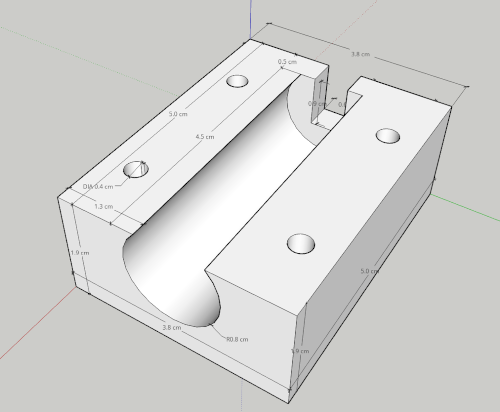

# Swagtron&reg; Swagboard&reg; T882 Hub Motor Mount

3D MakerBot&reg; Print, STL, and Sketchup&reg; models for mounting the Swagtron&reg; Swagboard&reg; T882 Hub Motor using M4 bolts.

M4 bolt pattern matches ServoCity&reg; 6x8 Hole Pattern Plate (9.00" x 12.00")].

## Images

<!--  -->
<!--  -->

<!--  -->


## Source Material

1. [Swagtron&reg; Swagboard&reg; T882](https://swagtron.com/product/swagtron-swagboard-hero-hoverboard-recertified/)
2. [ServoCity&reg; 6x8 Hole Pattern Plate (9.00" x 12.00")](https://www.servocity.com/9-x-12-aluminum-pattern-plate/) - SKU 585006

## Disclaimers

1. Swagtron&reg; and Swagboard&reg; are registered trademarks of [Swagtron&reg;](https://swagtron.com/)
2. [Makerbot&reg;](https://www.makerbot.com/) is a registered trademark of MakerBot Industries, LLC, a [Stratasys Company](https://www.stratasys.com/)
3. [ServoCity&reg;](https://www.servocity.com/) is a registered trademark of [ServoCity&reg;](https://www.servocity.com/)
4. [Sketchup&reg](https://www.sketchup.com/) is a 3D modeling program owned by [Trimble&reg; Inc.](https://www.trimble.com/)
5. This work is not endorsed, funded, sponsored, or supported by [Swagtron&reg;](https://swagtron.com/), [ServoCity&reg;](https://www.servocity.com/);, or [Trimble&reg; Inc.](https://www.trimble.com/)

## File Description

```txt
ST-882-motorMount
├── st-t882-mm-19mm-cs-*.skp            SketchUp file for hub motor mount  
├── st-t882-mm-19mm-cs-*.stl            STL file for hub motor mount  
├── st-t882-mm-19mm-cs-csMeasure.png    PNG image of countersinking in CAD model
├── st-t882-mm-19mm-cs-iso1*.png        Isometric PNG image of CAD model
├── st-t882-mm-19mm-cs-iso2*.png        Isometric PNG image of CAD model
├── st-t882-mm-19mm-cs-iso3*.png        Isometric PNG image of CAD model
├── README.md                           This document (a README)
```
